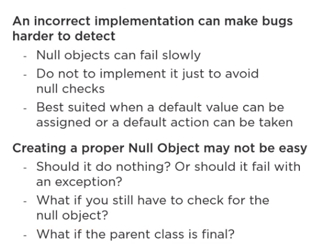

# Working with Nulls in Java
**Null** is a value that indicates that a reference does not refer to an object

## Best Practices for Data That "You" Don't Control
**Guiding Principles**
- Document your public API
- Fail Fast
- Be explicit - Try to make the intent of why some value cannot be `null` as clear as possible 

Data that cannot be controlled properly is the date from the entry points of the application.

1. Always validate parameter
- At the beginning of the method, respecting the principle of **Fail Fast**;
2. Throw an Exception (NullPointerException or IllegalArgumentException), If the input of a method that requires non-null values receive null;
3. As an alternative for the 2 point, the null can be replaced by a default value;

## Best Practices for Data That "You" Control
- No need to check for null in every method
	- Never pass null as an argument
		- Use primitives instead of wrapper classes
		- for optional parameters, overloading the methid with different sets of parameter is an alternative
	- Never return null
		- Return empty collections
		- Null Object Pattern
		- Optional Type

## Checking For Null Using Annotations
### Spring Annotations
The package `org.springframework.lang` defines the following annotations 
- `@NonNull` - Defines that a parameter or a return value cannot be null 
- `@Nullable` - Indicates that a element can be null
- `@NonNullApi` - Declares as **NonNull** the default behavior for parameters and return values
- `@NonNullFields` - Declares as **NonNull** the default behavior for fields.

- @Validated - Use it in the class level. If there is a constraint violation an CanstraintViolationException will be thrown 
#### Declaring all Methods of a Repository Interface as `@NonNullApi`

**File Structure**
- repository
	- BookRepository.java
	- *package-info.java*

**package-info.java**
```java
@org.springframework.lang.NonNullApi
package com.my.package.repository
```

### Bean Validation Annotations - Hibernate Validator

**FAQ**
1. Does hibernate Validator only validate objects of the domain model?
R: No, it validates objects in all layers
2. Are `@NotNull` and @Column(nullable=false), equivalent?
R: No, @Column is part of the JPA specification. If hibernates creates te table, it adds a **not null** constraint to the database column and the validatio is made by the database. By the other hand, @NotNull is part of the bean validation specification and performs its validations at the application level.

- `@NotNull` - Used in Fields and Method's parameters
- `@Valid` - `public void myFunction(@valid BookDTO book){...}`

PS: If the an Hibernate Entity (@Entity) class has some bean validation annotations, so the validation of this annotations will be trigged when the **EntityManager** is *flushed*


### Lombok Annotations
- `@NotNull` - Annotation for parameters of methods and constructors
	- if @Data is used, so this annotation will add validation for the constructor and setters

## Null Object Design Pattern
As some methods return `null` instead of real objects, or an object reference may be optionally `null` in an method parameter, many checks for null in code is made. The intent of a **Null Object Pattern** is to deal with the problem previusly reported by providing a substitutable alternative for `null`. 

### Diagram


### Concerns about the usage of Null Objects Design Pattern


## Optional
> Optional is a container object used to contain not-null objects. Optional object is used to represent null with absent value. This class has various utility methods to facilitate code to handle values as 'available' or 'not available' instead of checking null values.
> \- [Tutorialspoint](https://www.tutorialspoint.com/java8/java8_optional_class.htm)

### Unpacking a Value From an Optional
Use this methods to unwrap the value

```java
// To provide a default value
Book book = optionalBook.orElse(new Book())

// To provide a default value via **Supplier**
Book book = optionalBook.orElseGet(() -> new Book())


```

### Using Optional Through Composition

#### Filter method
This method takes a predicate as an argument. If the value is present in the Optional object and that value match with the predicate, the filter method returns the Optional, otherwise it returns an empty Optional.

**No Optional Object Usage**
```java
Book book = service.findBookById(id);

if(book != null && book.getNumberOfPages() > 500) {
	println(book)
}
```
**With Optional Object Usage**
```java
service.findBookById(id)
	.filter(book -> book.getNumberOfPages() > 500)
	.ifPresent(book -> println(book))
```

#### Map method
Applies the provided function only if the Optional contains a value.

**No Optional Object Usage**
```java
String title = "";
Book book = service.findBookById(id)
if(book !=null){
	title = book.getTitle()
}
```

**With Optional Object Usage**
```java
String title = service.findBookById(id)
	.map(book -> book.getTitle())
	.orElse("")
```

#### Flat Method
Supose that the book's method `getTitle()` return an Optional. So we are working with two level of optional in this scenario, the first from `findBookById(id)` and the second from `getTitle()`.

 In order to get the plain value from the optional returned by `getTitle()`,  use `flatMap` instead of `map()`

```java
String title = service.findBookById(id)
	.flatMap(book -> book.getTitle())
	.orElse("")
```

#### Optional Methos -  FlatMap x Map 
- If the function return a plain object, use `map`;
- If the function return a Optional object, use `FlatMap`;

### Optional Best Practices
- Never use `Optional.get()` unless It is certain that the Optional is not empty
- Generally, Optional shound not be used in fields
	- The Optional class is nt serializable
	- For truly optional fields, have a `getter()` method return Optional
- Do not use Optional as method argument, it is not necessay
**- Do use optional as a return value** 
