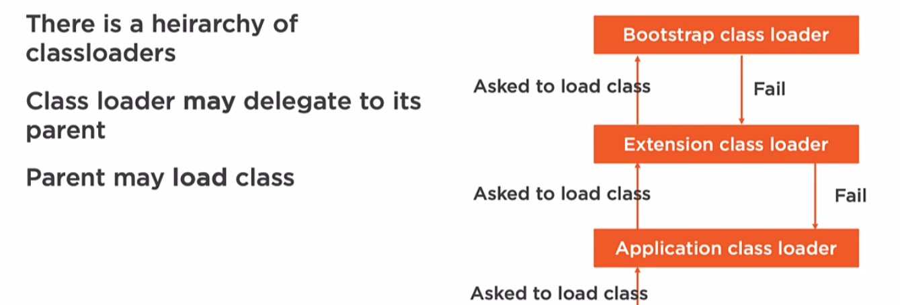

# Java - JVM Class Loading and Reflection

how to create a jar file: `jar cvf helper.jar com.example.Helper.class`

## Classloading - Java 8

- Core classes: They are loaded as part of the standard java

- Extension classes: They do not necessarily ship along with the Runtime, but may be used as they were runtime classes.  

- Delegation: It is how class loading works in Java. There is a hierarchy of class loaders.

- Displaying the delegation: Provides information about the class loaders such as their names, where they are trying to load their classes from.

## Delegation - Java 8
Java class loaders support delegation model when it comes to loading classes. Tipically in applications, there are more than one classloader. For example, there is the classloader that have to load the Extension classes and the classloader that needs to loads the base classes.

- There is a heirarchy of classloaders 
- each of these classloaders has a parent
- a classloader may delegate to its parant the job to load a class 
	- Usually it it the behavior (build-in class loaders), however when an custom class loader is made it may not delegates for its parent to execute loadings (you set the behavior if it will call the parent or not)
- Parent may load the class - when a classloader delegates to its parant to load a class, the parent **may** load a class. When a parent class loads a class, in the future it needs to keep loading this same class, and, tipically, when a class is loaded the classloader loads a class once. 

**Example 1 - Loading a basic java console application**

-> Formely **Application classloader is loaded** whose job is to load the classes from the **classpath**.
	-	-> Secondly **Extension classloader is loaded** .
	-	-	-> Finally **Boostrap classloader is loaded** (it is written in C)	

**Example 1 - Flow**
JVM -> asks  to Application Classloader to load a class
 ---> asks to Extension Classloader 	to load a class
 ----->  asks to Boostrap classloader to load a class  

If boostrap does not find it will fail and return the request to the Extension Classloader, that now will try to locate the class, if it fails then will return the request to load the class for Application Classloader (if if fails an exception NoClassDefFoundError will be thrown)



**Example 2 -  Code**

```java
import java.net.*;  
  
public class Delegation {  
  
    public static void main(String[] args) {  
  
       URLClassLoader classLoader = (URLClassLoader) ClassLoader.getSystemClassLoader();  
	   do {  
	      System.out.println(classLoader);  
	   } while ((classLoader = (URLClassLoader) classLoader.getParent()) != null);  
	  
	  System.out.println("Bootstrap ClassLoader");  
  }   
}
```
**Output**
```
//start
sun.misc.Launcher$AppClassLoader@2a139a55
sun.misc.Launcher$ExtClassLoader@7852e922
Bootstrap ClassLoader
//end
```

