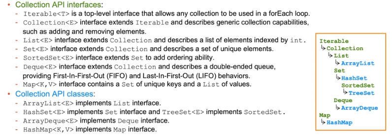

# Collections API
## Summary
- Introduce Java Collection API interfaces and implementations classes
- Use list, Set, Deque, and Map Collections
- Iterate through collections content
- Use Collections class
- Access collections concurrently

## Introduction to Java Collection API
Collection API presents a number of classes that maniputale groups of objects (collections)
- Collection Classes may provide features such as:
	- use generics
		- arrays do not use generics
	- dynamically expand as appropriate
	- provide alternative search and index capabilities
	- validate elements within the collection (ex: check uniqueness)
	- order elements
	- provide thread-safe operations (protect internal storage from corruption when it is accessed concurrently from multiple threads)
	- iterate through the collections
- Collection API defines a number of interfaces describing such capabilities
- Collection API classes implement these interfaces and can provide different combinations of capabilities

## Java Collection API Interfaces and Implementation Classes


## Create List Object
The class `ArrayList` implements `List` interface.
- when creating an `arraylist` using No-arg constructor, it will create a list of initial capacity of 10 elements
- it is possivel to use other `Collection` (for example, `Set`) to populate this list with initial values
- A fixed-size `List` can be created using a var-arg method `ArrayList.asList(<T> ...)`
	-  **This List is just a wrapper that makes the array available as a list. No data is copied or created.**
	- **Also, we can't modify its length because adding or removing elements is not allowed.**
	```java
	String[] stringArray = new String[] { "A", "B", "C", "D" };
	List stringList = Arrays.asList(stringArray);
	stringList.add("F");
	```

	```java
	java.lang.UnsupportedOperationException
		at java.base/java.util.AbstractList.add(AbstractList.java:153)
		at java.base/java.util.AbstractList.add(AbstractList.java:111)
	```
	- we can modify single items inside the array. Note that all the  **modifications we make to the single items of the  _List_  will be reflected in our original array**
	- **we can use  _ArrayList<>(Arrays.asList(array))_ when we need to create a  _List_  out of an array**. By doing this way it will create an independent copy of the array, which means that **modifying the new list won't affect the original array**.

- A read-only instance of `List` can be created using a var-arg method `List.of(<T>...)`
- `ArrayList` will auto-expand its internal storage, when more elements are added to it

## Create Set Object
- load factor estabilish how full you want  internal storege within the set to get before the set starts reshuflling (reorganize or change the positions of) the buckets and optimizing that storage 

## Resources
- [Arrays.asList vs new ArrayList(Arrays.asList())](https://www.baeldung.com/java-arrays-aslist-vs-new-arraylist)
