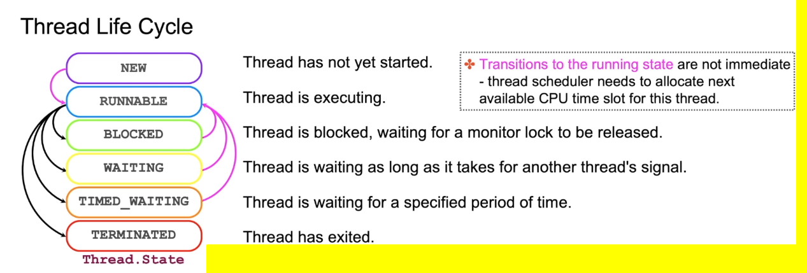
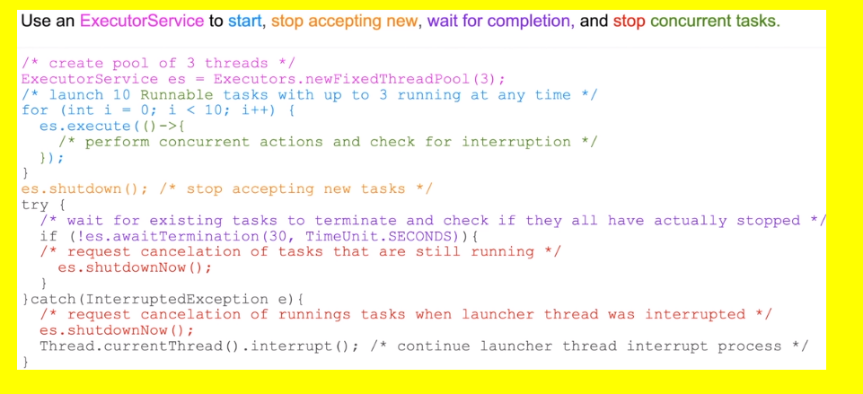

# Concurrency-Multithreading
## Java Concurrency Concepts
- Thread in a Java program is an execution path. It may involve a series of different method calls, and you carry out whatever business logic you need within a given thread.
- Each thread can be an object that is an implementation of a `Runnable` interface. `Runnable` interface decribes a single method `run` where the thread actions should be put. 
- The method `run` is not called directly, instead the `runnable` object is wrapped into an object of the type `Thread`. The thread schedule will try to execute the method run, but it will do it in a separate thread from that one of the method main.
- Thread scheduler will allocatie portions of CPU time (time-slice) to execute thread actions.
```java
Lateral la = new Lateral();
new Thread(la).start();
```
```java
puublic class Lateral implements Runnable {
	public void run() {
		//thread actions
	}
}
```
- Java threads time-slice hardware threads (processors) provided by the CPU cores and can be interrupted at any time to give way to another thread, making the order of actions performed by different threads stochastic
- The return of method `main` or `run` terminates the thread.

- Thread is like a car.
- the actions defined in the method run is like a route that a car should follow.

## Implement Threads
**Common Practice**
```java
Lateral la = new Lateral();
new Thread(la).start();
```
```java
puublic class Lateral implements Runnable {
	public void run() {
		//thread actions
	}
}
```

**Good For small amount of actions**
```
Runnable r = () -> {
	//code
}

Thread t = new Thread(r);
t.start();
```

## Thread Life Cycle


- The same `Runnable` instance can be wrapped up by more than one `Thread` instance and stated as different threads.
- You can verify if thread has not yet terminated and its life cycle phase
- **Same `Thread` instance cannot be started twice.**

```java
Runnable r = () -> {
	//code
}
Thread t1 = new Thread(r);
Thread t2 = new Thread(r);
t1.start();

t2.isAlive();
Thread.State phase = t2.getState();
```

## Interrupt Thread
Logic of a `run` method is in charge of making life cycle decisions.
- a thread in a `runnable` state may check if it has received an interrupt signal
- A thread that has entered a `waiting` or `time waiting` state musch catch `InterruptedException`, which puts it back to `runnable` state, and then decided what it should do.

- `myThread.interrupt()` - When thread is in the running state it is not forced to check this signal unless there are a check (ex: `Thread.currentThread().isInterrupted()`) in the method `run` for this operation.

- When the thread is "sleeping", it is not running, actually, it is a timed waiting state so no interrupted checks is being performed.
	- So if, at the point in time when the thread is asleep, somebody call an `interrupt` method upom the thread, the method `sleep` will be interrupted and will throw an exception `InterruptedException`. This exception can be catch and a decision can be made to choose what is going to happen with that thread. 


## Block Thread
The `Monitor` object helps to coordinate order of execution of threads
- any object or a class cam be used as a monitor
- it allows threads to enter blocked or waiting states
- it enables mutual exclusion of threads and signaling mechanisms

- **THREADS ARE BLOCKED AGAINST MONITORS** (`synchronized`)

Keyword `synchronized` enforces exclusive access to the block of code
- Thread that first enterns the `synchronized block`  remais in **runnable state**
- All other threads accessing the same block enter the **block state**
- When a runnable thread exits the `synchronized block`, the lock is released
- Another thread is now allowed to enter the runnable state and place a new lock

```java
public class Some {
	public void synchronized a () {}
	public static void synchronized b() {}
	public void c () {}

}

Some s = new Some();
Runnable r = () -> {
  s.a();
  Some.b();
  synchronized (s) {
	  s.c();
  }
}
```
### apply `synchronized` keyword to a instance method
- Put the current object (this) for the method with de `synchronized` keyword  in a blocked state
- If a current instance is choosen to be the monitor then each instance of some will have it's own monitor. So they will not be blocking each other. **However**, if you launch more than one thread using the same instance of `some` **in between these threads, they will be blocking each other**, when they are using current object as the monitor.


### apply apply `synchronized` keyword to a static method
- Allow to use a class as a monitor rather than a current object. It will block the thread against the overall class
- It threads are associated with different instances of some, **using synchronized against static context** then all those different instances of some will be blocking each other against the class itself (PS: remember, class context is shared between all instances.) 

### apply `synchronized` keyword in a block of code inside a method

## Make Thread Wait Until Notified
Suspend a thread waiting indefinitely
- method `wait` puts a thread into `waiting state` against **specific monitor**
- any number of threads can be waiting against the same monitor

- method `notify` wakes up one of the waiting threads (stochastic)
- method `notifyAll` wakes up all waiting threads currently in a waited state against a given monitor
	- threads waits until another thread tells the monitor object against which this thread is waiting that the thread is allowed to resume
	- **throws an `InterruptedException` when you call the method 'notify' of the monitor**
- methods `wait, notify, notifyAll` must be invoked within `synchronized` blocks against the same monitor

```java
Some s = new Some();
Runnable r = () -> {
	try{
		synchronized (s) {
		    s.wait(); // Throws an InterruptedException when you call the method 'notify' of the monitor object  
		}
	} catch(InterruptedException ex) {...}
  }
}

Thread t = new Thread(r);
t.start();
try{
	Thread.sleep(1000);
} catch(InterruptedException ex) {...}

synchronized (s) {
	s.notify;
}
```

## Common Thread Properties
- Thread could be given a custom name using constructor and `set/get name` methods
- Thread has a unique id
- Thread can be marked as a **deamon** or a **user** (default) thread
	- deamon
- Thread may wait for another thread to terminate
- Thread could be assigned a priority

- Priority determines the number of CPU time slots the thread scheduler allocates to this thread, but it cannot guarantee the order of execution
- The JVM exits when the only remaining threads still running are all daemon threads
- Method `setDaemon` muust be invoked before the thread is started

- `join()` waits for the thread to terminate
	- It allows to put threads in certain order

```java
Runnable r = () -> { ... };
Thread t = new Thread(r);
t.start();
try{
	t.join(); // wait for the thread to terminate
} catch(InterruptedException ex) {...}
```

## Create Executor Service Objects
Class `java.util.concurrent.Executors` provides a number of thread management automations using different `ExecutorService` objects:
- **fixed thread pool** reuses a fixed number of threads;
- **work stealing pool** maintains enough threads to support the given parallelism level
- **single thread executor** uses a single worker thread
- **cached thread pool** creates new threads as needed or reuses existing threads
- **scheduled thread pool** schedules tasks to execute with a deplay and/or periodically
- **single thread scheduled executor** schedules tasks to execute with a delay using a single worker thread
- **unconfigurable executor service** provides a way to freeze another ExecutorService configuration. It does not allow reconfigure other ExecutorsServices already being in use (make it final but for everything)

```java
Runnable r = () -> { ... };
ScheduuledExecutorService ses = Executors.newScheduledThreadPool(3);

// Scheduules a Runnable task to be executed very 5 seconds with initial delay of 10 seconds
ses.scheduleAtFixedRate(task, 10, 5 TimeUnit.SECONDS); // Schedule one or more tasks, with different delays and periods using the same thread pool.

ExecutorService es = Executors.unconfigurableExecutorService(ses); // Freezes the configuration of the executor service to prevent any changes
t.start();
try{
	t.join(); // wait for the thread to terminate
} catch(InterruptedException ex) {...}
```

### Manage Executor Service Life Cycle


## Implementing Executor Service Tasks
`ExecutorService` supports two types of taks implementations:
- Runnable Objects
	- implementing `public void run();` method of `Runnable` interface
	- Launched using execute or submit methods of the `executorService`
- Callable objects
	- implementing `public <T> call() throws Exception;` method of `Callable` interface
	- launched using `submit` method of the `ExecutorService`
	- returned value is wrapped into the `Future` object, which is returned immediately
	- method `get` blocks invoking thread until timeout our when the value within the `Future` object becomes available

```java
Callable<String> t = new Callable<>() {
	public String call() throws exception {
			return "some value";
			
		}};
```

```java		
ExecutorService es = Executor.newFixedThreadPool(10);
Future<String> result = es.submit(t);
try {
	String value = result.get(10, TimeUnit.SECONDS);
} catch(Exception ex) {...}
```